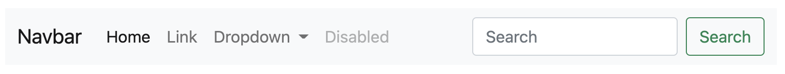
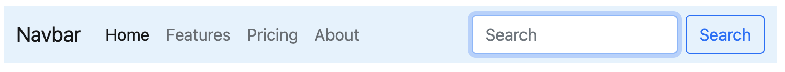

# Ask Jennie Python Package
The package is a part of ASK Jennie Complete Product.

## Task List

##### - Install bootstrap in project with jquery 
```shell
jennie install bootstrap
```
## UI Gallery

#### Bootstrap Gallery

##### - Add Bootstrap Navbar Light to project

```shell
jennie bootstrap add navbar-light
```

##### - Add Bootstrap Navbar Dark to project

```shell
jennie bootstrap add navbar-dark
```

##### - Add Bootstrap Navbar Primary to project

```shell
jennie bootstrap add navbar-primary
```

##### - Add Bootstrap Navbar with Custom Color to project
 

```shell
jennie bootstrap add #e3f2fd
```

- Replace `#e3f2fd` with required color code.
  
